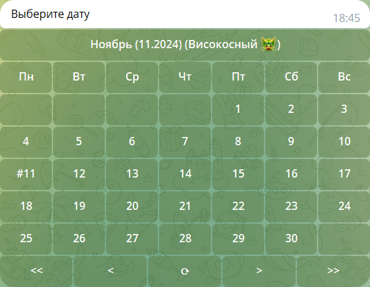
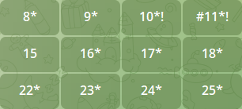
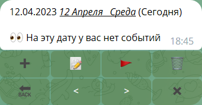

<table>
    <td><a href="/README.md">EN</a></td>  <!--  -->
    <td><a href="/README_ru.md">RU</a></td>  <!--  -->
</table>

<h1>Бот для организации заметок по датам.</h1>
<i>Хранение, добавление, редактирование и удаление заметки по дате.
Можно пометить заметку эмодзи.
Удобный поиск по эмодзи статусам и датам.
Дни рождения и праздники помечаются на календаре (нужно поставить эмодзи статус).</i>\

---

По команде `/calendar` вам доступен календарь.
Вы можете сразу выбрать дату или пролистать на другой месяц или год кнопками `<` `>` и `<<` `>>` соответственно.<br>
Кнопка `⟳` возвращает календарь на текущую дату если он находится на другой, иначе она заходит на один этап ниже по меню и в итоге откроет сообщение с текущей датой.<br>
При нажатии самой верхней кнопки с названием месяца и информацией о годе можно открыть список месяцев.



В календаре существуют несколько обозначений.

| Знак | Значение                                                                                                                                                                                                                 |
|:----:|:-------------------------------------------------------------------------------------------------------------------------------------------------------------------------------------------------------------------------|
| `#`  | Сегодняшний номер дня (показывается в любых месяцах)                                                                                                                                                                     |
| `*`  | В этот день есть события                                                                                                                                                                                                 |
| `!`  | В этот день или в этот день другого года есть<br>событие с статусом или день рождения `🎉`<br>или праздник `🎊`<br/> <details><summary>Подробнее</summary>Это помогает не забыть, что у кого то день рождения.</details> |




При нажатии на кнопку в календаре с датой открывается сегодняшняя дата.

| Кнопка  | Действие                      |
|:-------:|:------------------------------|
|   `➕`   | Добавить событие              |
|  `📝`   | Отредактировать событие       |
|  `🚩`   | Поставить статус для события  |
|  `🗑`   | Удалить событие               |
|  `🔙`   | Назад                         |
| `<` `>` | На 1 день вперёд или назад    |
|   `✖`   | Удалить это сообщение от бота |




# [Limits](/func.py#L771&L775)

В боте существуют лимиты для разных групп пользователей.

| user_status | price | maximum characters/day | maximum events/day |
|:------------|:------|:-----------------------|:-------------------|
| default     | 0     | 4000                   | 20                 |
| premium     | 🤷    | 8000                   | 40                 |
| admin       | -     | ∞                      | ∞                  |

# [Поиск](/func.py#L684&L704)

В боте есть поиск по событиям. Искать можно командами `#query` или `/search query`.
Такой поиск пытается найти все совпадения.<br>
Запрос`#1 2` ищет все события, в которых есть цифры 1 <b>ИЛИ</b> 2 (`t1ext`, `tex2t`, `2te1xt`)<br>
Так же существует поиск <b>И</b>. Он ищет только те события, в которых все условия полностью совпадают. Искать таким поиском можно командой `#!query` или `/search! query`.<br>
Запрос `#!1 2` бот вернёт только те события, в которых есть 1 <b>И</b> 2 (`text12`, `te2xt1`).

В поисковом запросе можно использовать шаблоны

| Что искать     | шаблон/ы                                                               |
|:---------------|:-----------------------------------------------------------------------|
| Дата           | `date=dd.mm.yyyy`<br>`date=dd.mm`<br>`date=mm.yyyy`<br>`date=dd..yyyy` |
| Номер дня      | `day=00`                                                               |
| Номер месяца   | `mon=0`<br>`month=0`                                                   |
| Год            | `year=0000`                                                            |
| Статус события | `status=⬜️`                                                            |
| id события     | `id=0`                                                                 |

Например `#date=1.2023 status=🎧 youtube.com` для поиска всех событий со статусом музыки за январь 2023 года, в которых есть ссылка на youtube.


<details>
<summary>Commands</summary>

# [Commands](/lang.py#L472)
| Command          | Description                 |
|:-----------------|:----------------------------|
| /start           | Start                       |
| /calendar        | Calendar                    |
| /today           | Today's message             |
| /weather {city}  | Weather                     |
| /forecast {city} | Weather forecast for 5 days |
| /week_event_list | Weekly events               |
| /dice            | Roll the dice (randomizer)  |      
| /save_to_csv     | Save my data in csv         |     
| /help            | Help                        |                          
| /settings        | Settings                    |
| /search {query}  | Search                      |
| #{query}         | Search                      |

</details>

<details>
<summary>DataBase</summary>

# [DataBase](/func.py#L93&L125)

* ### [root](/func.py#L102&L109)
| name     | data type | default value |
|:---------|:----------|:--------------|
| event_id | INT       | _NULL_        |
| user_id  | INT       | _NULL_        |
| date     | TEXT      | _NULL_        |
| text     | TEXT      | _NULL_        |
| isdel    | INT       | 0             |
| status   | TEXT      | ⬜️            |

* ### [settings](/func.py#L115&L125)
| name              | data type | default value |
|:------------------|:----------|:--------------|
| user_id           | INT       | _NULL_        |
| lang              | TEXT      | ru            |
| sub_urls          | INT       | 1             |
| city              | TEXT      | Москва        |
| timezone          | INT       | 3             |
| direction         | TEXT      | ⬇️            |
| user_status       | INT       | 0             |
| user_max_event_id | INT       | 1             |

</details>

# #TODO
* [ ] При попытке создания файлов сразу обновлять начальный набор команд для всех пользователей.
* [ ] Если на конкретный день сейчас нет событий, а раньше были и они остались в старом сообщении, то обработать ошибку и обновить сообщение.<br>Вместо того чтобы парсить из сообщения делать запрос к базе данных.
* [ ] Прокомментировать и почистить код.
* [ ] Группы для статусов событий.
* [ ] Возможность в поиске перейти по дате выбранного события.
* [ ] В поиск добавить шаблоны<br>
 `#date=dd.mm.yyyy` or `#date=dd.mm` or `#date=mm.yyyy` or `#date=dd..yyyy`<br>
 `#day=00`<br>
 `#month=0`<br>
 `#year=0000`<br>
 `#status=⬜️`<br>
 `#id=0`<br>
 Например `#date=1.2023 status=🎧` для поиска всех событий со статусом музыки за январь 2023 года.<br>
 Добавить поддержку спецсимволов sql LIKE (%, _ и.т.д.).<br>
 Поиск <b><u>И</u></b> `#!query` только то, что в поиске без вариаций.
* [ ] Добавить возможность конвертировать валюты через api.


* [ ] Explorer (Подобие файловой системы)<br>
  Для хранения больших текстовых файлов или изображений (<u>admin only</u>).<br>
  <b>Возможно сделать через api гугл|яндекс диска</b>
* [ ] Когда добавляешь событие пусть если фото или файл прикреплено к сообщению то бот к тексту добавляет ссылку на файл, а текст берёт из `message.caption`.
* [ ] Когда удаляешь файл, то пусть все привязки к нему удаляются.

* [ ] Полноценные уведомления.


# Already done
* [X] Возможность просмотра _повторяющихся событий_ в команде `/week_event_list`.
* [X] Сортировка в week_event_list по датe.
* [X] Статусы расписания. Повторение каждую неделю и год. Похожее на статус дня рождения.
* [X] Возможность удалить из корзины.
* [X] Возможность восстановить событие из корзины.
* [X] Добавить погоду на 5 дней `/forecast {city}`
* [X] SQL ORM с диапазонами.
* [X] Генерация сообщений по шаблону `"{template}"`.
* [X] Изменение user_status для админов, добавить статус -1 это в бане (игнор сообщений).<br>
  Изменение списка команд для пользователя в зависимости от user_status


# Removed from TODO
* <s>Команда `/account`. Количество сообщений.<br>
  Как в GitHub, график наличия событий цветными смайлами `⬜️(0) 🟩(1,3) 🟨(4,6) 🟧(7,9) 🟥(>=10)`</s>
* <s>_Убрать возможность пересылки обычных сообщений_</s>
* <s>Вставлять праздники за прошлые года</s>
* <s>Добавить возможностью делиться результатом через поиск</s>
* <s>Праздники на каждый день</s>

---

```
git clone https://github.com/EgorKhabarov/TODO-telegram-bot .
```
```
pip install -r requirements.txt
```
